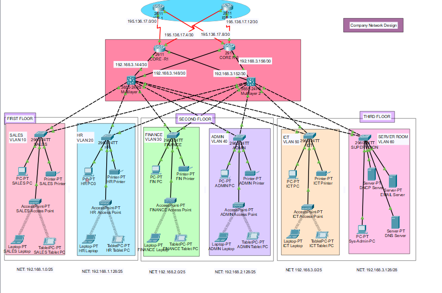
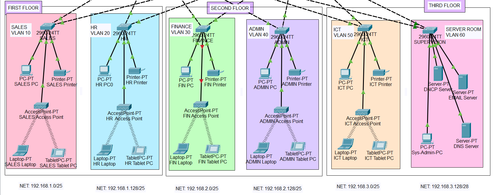
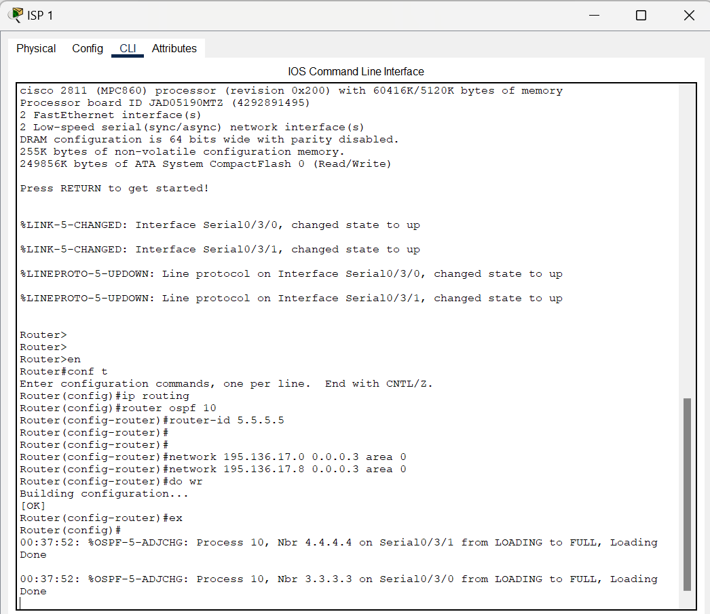
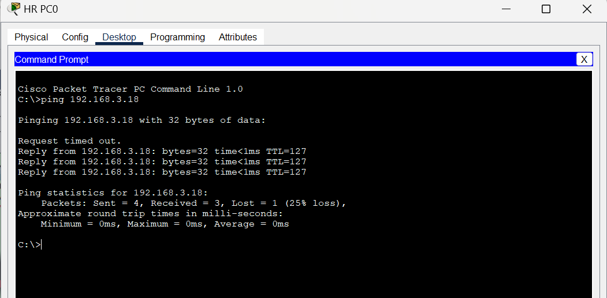

## company-network-design
Cisco Packet Tracer based network design and simulation project.

## Project Overview
This project focuses on designing and implementing a scalable, secure, and robust network infrastructure suitable for medium to large organizations. It follows industry best practices, including hierarchical architecture, VLAN segmentation, and dynamic routing to ensure high performance and manageability.

---

## Objectives
- Design a structured enterprise network using a hierarchical model  
- Implement logical segmentation via VLANs and efficient IP subnetting  
- Enable inter-VLAN communication using Layer 3 routing  
- Provide redundant internet connectivity and deploy wired/wireless access  
- Implement security controls for traffic filtering and device access  

---

## Network Architecture
The design utilizes a **Three-Tier Hierarchical Model**:

### Core Layer
- Handles high-speed routing and external ISP connectivity  
- Includes redundant routers for high availability  

### Distribution Layer
- Uses multilayer switches for inter-VLAN routing  
- Performs traffic aggregation and policy enforcement  

### Access Layer
- Connects end devices and wireless access points  
- Implements port-level security  

---

## Implementation Details

### VLAN Segmentation

| VLAN ID | Department   |
|----------|--------------|
| 10       | Sales        |
| 20       | HR           |
| 30       | Finance      |
| 40       | Admin        |
| 50       | ICT          |
| 60       | Server Room  |

---

### Routing & Connectivity
- Inter-VLAN Routing: Configured using SVIs on multilayer switches  
- Dynamic Routing: OSPF used for fast convergence and scalability  
- Redundancy: Dual edge routers connected to multiple ISP links  

---

## Network Services
- **DHCP:** Automatic IP assignment for all VLANs  
- **PAT (Port Address Translation):** Enables internet access for private IPs while hiding internal network structure  

---

## Security Features
- **Port Security:** MAC limiting, sticky MAC, and port shutdown on violation  
- **Access Control Lists (ACLs):** Controls traffic between VLANs  
- **Secure Management:** SSH access, encrypted passwords, and login banners  

---

## Testing & Verification
- VLAN connectivity testing  
- Inter-VLAN routing verification  
- DHCP IP assignment validation  
- Wireless connectivity checks  
- Internet access testing via PAT  
- Routing table and OSPF verification  

---

## Future Enhancements
- Integration of Firewalls and IDS/IPS  
- Network monitoring using SNMP and Syslog  
- IPv6 implementation  
- Centralized AAA authentication  

---
## 📸 Screenshots

### Network Topology

### VLAN Configuration

### Routing Table (OSPF)

### Ping Pc

## Project Members
- Ambreen Naeem  
- Sameea Amjad  
- Sadaf Fatima  
